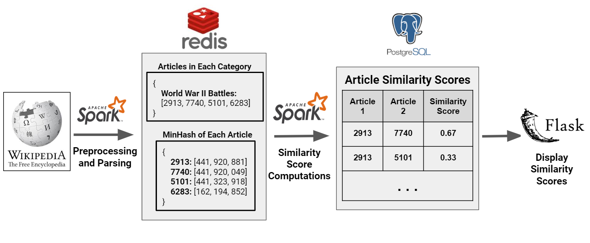

# MergeReduce
Website: insightfulsolutions.agency
---
### Overview
Figuring out whether two bodies of text are similar is an easy task. But what if you're a forum determining which questions and answers are most similar among millions? Or a site detecting plagiarized essays uploaded to it? Or a web hosting platform that wants to test whether users make large changes to default web templates it offers? MergeReduce addresses the challenges of these large-scale text comparison endeavors. It's a pipeline that ingests bodies of text and determines which ones are similar or identical, utilizing technologies like Spark and Redis to work at scale. The text used is Wikipedia articles, which are good to work with because:
1. There's a lot of text, and it's publicly available
2. Given the structured nature of Wikipedia articles, it's easy to quickly validate that two articles are similar in content
3. Determining similar Wikipedia articles is analogous to the business use cases listed above.

The pipeline utilizes Spark, Redis, article comparison limited to articles in each category, and the MinHash text comparison algorithm to scale up more effectively in terms of computation and storage.

### Pipeline Architecture

### Structure
At the first level of the directory, there are three scripts that run the pipeline:

_extract-wiki-data.sh_: take an unzipped "enwiki-latest-pages-articles" wikipedia file from the data dump (https://dumps.wikimedia.org/enwiki/latest/) and run WikiExtractor code to parse the text and categories out of the raw XML data. WikiExtractor code is at https://github.com/attardi/wikiextractor for reference; I added a few lines of code to automatically include the article category

_preprocess-wiki-data.sh_: run standard NLP preprocessing on output of extract-wiki-data.py, including tokenization, removal of stopwords and punctuation, and stemming (normalizing) words. Breaks text into shingles, or n-grams, to prepare for minhash computation. Computes minhash values for each article. A key-value mapping of article categories to article id's, as well as a key-value mapping of article id's to minhash values, are inserted into Redis.

_calc-dedupe-candidates.sh_: calculate article pairs that may be potential duplicate candidates based on overlap of minhash values.

To see the Python program each script runs, look in the .sh file to see the file path the program redirects to.

### Notes

- Most code imports values from the config and/or utils files under src/config and src/lib, respectively.
- The WikiExtractor code is pretty extensive, and since I had to make some changes to the code I'm not just cloning the repo. Unfortunately this means a lot of code to look over but I'd recommend skimming at most.

